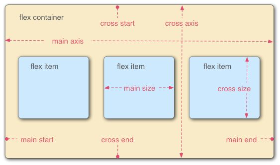

# Class08: CSS Layout

## Learn CSS - Flexbox

* Flexbox is designed for one-dimensional content. Explain what this means.

they have property means `flex-direction` in which state where the main axis goes. and from that base line we do css syle for web. 

once direction of flex set, we can find cross axis.

* Explain the difference between the main axis and cross axis.

main axis is the direction of `flex-direction:` property 

for example. if `flex-direction: `
is`row` then main axis will srat from first row, from left to right

* How can using certain properties of flexbox negatively impact accessibility?

strictly follow structure sementic and proper labelling

Flexbox should not be used as a substitute for semantic markup.

## CSS Layout - Flexbox

## Flex-Flow Shorthand

* What are some advantages of using flexbox over float?

- Simplified and intuitive layout:
easily align and distribute elements along both the main and cross axes, resulting in cleaner and more maintainable code.

- Responsive and adaptable design

easier to create layouts that automatically adjust to different screen sizes and devices

* How does this topic connect with your long term goals?

In longterm goal, I realized the `flex` is very important to layour website, so that it can hav a reponssive and clear design. a bare-bone property to help user easier to access website.
